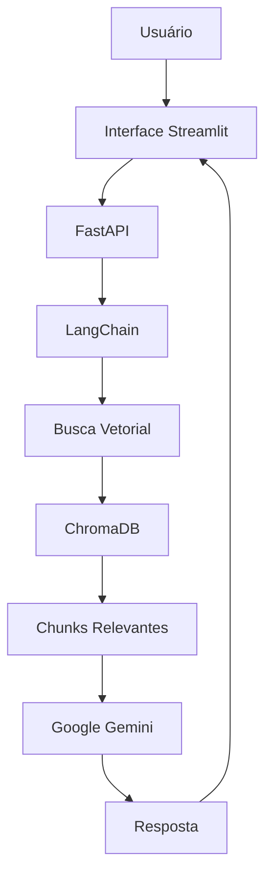
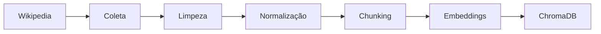
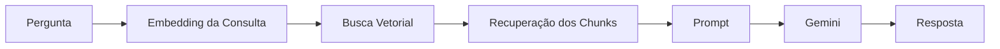

# 🇧🇷 BrasilnaCopaAI

> Um chatbot inteligente baseado em **Retrieval-Augmented Generation (RAG)** capaz de responder perguntas sobre a participação da **Seleção Brasileira na Copa do Mundo FIFA 2026**, utilizando documentos da Wikipedia como base de conhecimento e o Google Gemini para geração de respostas contextualizadas.

<p align="center">


</p>

---

# 📑 Sumário

- Sobre o Projeto
- Objetivos
- Motivação
- Arquitetura
- Fluxo da Aplicação
- Stack Tecnológica
- Estrutura Geral
- Metodologia de Desenvolvimento
- Roadmap
- Backlog
- Como Executar
- Licença

---

# 📖 Sobre o Projeto

O **BrasilnaCopaAI** é um projeto de portfólio desenvolvido com foco em **Inteligência Artificial Generativa**, **Retrieval-Augmented Generation (RAG)** e **Engenharia de Dados**.

O projeto consiste em um chatbot especializado na participação da **Seleção Brasileira durante a Copa do Mundo FIFA 2026**, sendo capaz de responder perguntas utilizando uma base documental previamente indexada.

Ao invés de depender exclusivamente do conhecimento do modelo de linguagem, o sistema realiza buscas em um banco vetorial contendo documentos extraídos da Wikipedia. Apenas os trechos mais relevantes são enviados ao modelo generativo, permitindo respostas mais confiáveis, contextualizadas e com menor probabilidade de alucinações.

O objetivo principal não é desenvolver apenas um chatbot, mas sim construir uma aplicação completa baseada em RAG, reproduzindo uma arquitetura semelhante à utilizada por aplicações modernas de Inteligência Artificial.

---

# 🎯 Objetivos

Este projeto foi concebido para demonstrar conhecimentos em:

- Python
- FastAPI
- Streamlit
- Engenharia de Dados
- Retrieval-Augmented Generation (RAG)
- LangChain
- Bancos Vetoriais
- Embeddings
- APIs de Large Language Models (LLMs)
- Engenharia de Prompt
- Arquitetura de Software
- Organização de projetos profissionais

Ao final do desenvolvimento, espera-se possuir um projeto que demonstre todo o ciclo de construção de uma aplicação moderna baseada em Inteligência Artificial.

---

# 💡 Motivação

Grande parte das aplicações atuais de IA utiliza Retrieval-Augmented Generation para complementar modelos de linguagem com conhecimento específico de um determinado domínio.

O BrasilnaCopaAI foi escolhido como tema por possuir um escopo bem definido, permitindo concentrar o desenvolvimento na arquitetura da solução em vez da complexidade do domínio.

Dessa forma, o projeto serve como laboratório para estudar e aplicar conceitos modernos de IA, mantendo um problema suficientemente pequeno para ser desenvolvido individualmente.

---

# 🎯 Escopo do MVP

Esta primeira versão será um **Minimum Viable Product (MVP)**.

O chatbot responderá perguntas exclusivamente sobre:

- Seleção Brasileira;
- jogadores;
- comissão técnica;
- partidas;
- adversários;
- grupos;
- fases da competição;
- estatísticas presentes nos documentos;
- desempenho durante a Copa do Mundo FIFA 2026.

Toda resposta deverá ser baseada nos documentos previamente indexados.

Caso uma informação não esteja presente na base de conhecimento, o sistema deverá informar essa limitação ao usuário, evitando gerar respostas sem embasamento.

---

# 🏗 Arquitetura da Solução

O projeto será dividido em duas aplicações independentes:

- **Backend**, responsável por toda a lógica da aplicação.
- **Frontend**, responsável apenas pela interface do usuário.

O backend será desenvolvido utilizando **FastAPI**, enquanto a interface será construída com **Streamlit**.

A comunicação entre ambos ocorrerá através de requisições HTTP.

---

# 📐 Arquitetura Geral

```text
                 ┌──────────────────────────┐
                 │        Usuário           │
                 └─────────────┬────────────┘
                               │
                               ▼
                 ┌──────────────────────────┐
                 │       Streamlit UI       │
                 └─────────────┬────────────┘
                               │ HTTP
                               ▼
                 ┌──────────────────────────┐
                 │        FastAPI API       │
                 └─────────────┬────────────┘
                               │
                  ┌────────────┴─────────────┐
                  │                          │
                  ▼                          ▼
          LangChain Pipeline         Google Gemini API
                  │
                  ▼
             ChromaDB
                  │
                  ▼
     Documentos indexados da Wikipedia
```

---

# 🔄 Fluxo Geral da Aplicação



---

# 📚 Fluxo de Ingestão de Dados

Antes que o chatbot possa responder perguntas, é necessário construir sua base de conhecimento.

Os documentos passarão pelas seguintes etapas:



---

# 🔎 Fluxo de Consulta (RAG)

Sempre que um usuário fizer uma pergunta, o sistema executará o seguinte processo:



---

# 🛠 Stack Tecnológica

## Linguagem

- Python 3.12+

---

## Backend

- FastAPI
- Uvicorn
- Pydantic

O FastAPI será responsável por:

- disponibilizar a API REST;
- processar as perguntas do usuário;
- integrar LangChain;
- comunicar-se com o banco vetorial;
- consumir a API do Google Gemini.

---

## Frontend

- Streamlit

O Streamlit será utilizado para construir uma interface simples e interativa, permitindo que o foco do projeto permaneça na arquitetura de IA.

---

## Inteligência Artificial

- Google Gemini API
- LangChain

O LangChain será responsável por orquestrar todo o pipeline RAG.

---

## Banco Vetorial

- ChromaDB

Responsável pelo armazenamento dos embeddings e pela recuperação semântica dos documentos.

---

## Processamento de Dados

- Wikipedia API
- Requests
- BeautifulSoup
- Pandas

Essas bibliotecas serão utilizadas durante a etapa de ingestão e preparação dos documentos.

---

## Controle de Versão

- Git
- GitHub

Todo o desenvolvimento será realizado utilizando versionamento incremental, com commits frequentes e documentação contínua.

---

# 📁 Estrutura do Projeto

A organização do projeto foi pensada para manter uma separação clara entre interface, API, pipeline RAG e processamento dos dados.

```text
BrasilnaCopaAI/
│
├── app/
│   ├── api/                 # Rotas da API FastAPI
│   │   ├── routes.py
│   │   └── __init__.py
│   │
│   ├── ingestion/           # Coleta e processamento dos documentos
│   │   ├── wikipedia.py
│   │   ├── preprocessing.py
│   │   ├── chunking.py
│   │   └── embeddings.py
│   │
│   ├── rag/                 # Pipeline Retrieval-Augmented Generation
│   │   ├── retriever.py
│   │   ├── prompt.py
│   │   ├── chain.py
│   │   └── generator.py
│   │
│   ├── services/            # Serviços externos
│   │   ├── gemini.py
│   │   └── wikipedia.py
│   │
│   ├── vectorstore/         # Banco vetorial
│   │   └── chroma.py
│   │
│   ├── models/              # Modelos Pydantic
│   │   ├── request.py
│   │   └── response.py
│   │
│   ├── utils/               # Utilidades
│   │
│   └── main.py              # Inicialização da API
│
├── streamlit/
│   └── app.py               # Interface da aplicação
│
├── data/
│   ├── raw/                 # Documentos brutos
│   ├── processed/           # Documentos limpos
│   └── embeddings/          # Base vetorial
│
├── tests/
│
├── docs/
│
├── requirements.txt
├── .env.example
├── .gitignore
├── LICENSE
└── README.md
```

Essa estrutura poderá sofrer pequenos ajustes durante o desenvolvimento, mantendo sempre a separação de responsabilidades entre os componentes da aplicação.

---

# 🧩 Componentes da Aplicação

O projeto é dividido em módulos independentes, cada um com uma responsabilidade bem definida.

## FastAPI

O backend será responsável por toda a lógica da aplicação.

Entre suas responsabilidades estão:

- receber perguntas do usuário;
- validar os dados de entrada;
- consultar o pipeline RAG;
- recuperar documentos relevantes;
- enviar o contexto ao Gemini;
- retornar a resposta ao frontend.

Nenhuma regra de negócio ficará implementada na interface Streamlit.

---

## Streamlit

O Streamlit atuará exclusivamente como camada de apresentação.

Suas responsabilidades incluem:

- interface do chat;
- envio das perguntas;
- exibição das respostas;
- histórico da conversa;
- indicadores de carregamento.

Toda a lógica permanecerá concentrada no backend.

---

## Pipeline de Ingestão

Antes da aplicação entrar em funcionamento, será necessário preparar a base de conhecimento.

Esse pipeline será executado apenas quando novos documentos precisarem ser adicionados ou atualizados.

Suas etapas serão:

1. coleta das páginas da Wikipedia;
2. remoção de conteúdos desnecessários;
3. normalização dos textos;
4. divisão em chunks;
5. geração dos embeddings;
6. armazenamento no ChromaDB.

---

## Pipeline RAG

Durante a utilização do chatbot, será executado o pipeline de Retrieval-Augmented Generation.

Esse processo será composto pelas seguintes etapas:

1. receber a pergunta;
2. gerar o embedding da consulta;
3. realizar busca vetorial;
4. recuperar os documentos mais relevantes;
5. montar o prompt;
6. enviar o contexto ao Gemini;
7. retornar a resposta ao usuário.

---

# 📦 Base de Conhecimento

Inicialmente, a base documental será composta por páginas da Wikipedia relacionadas à Copa do Mundo FIFA 2026 e à Seleção Brasileira.

Entre elas:

- Copa do Mundo FIFA de 2026;
- Seleção Brasileira;
- elenco da Seleção;
- comissão técnica;
- partidas disputadas;
- grupos;
- estatísticas;
- fases da competição.

Toda a base será previamente indexada antes da utilização do chatbot.

O projeto não realizará pesquisas em tempo real durante as consultas.

---

# 🧠 Estratégia de Recuperação

O chatbot seguirá a abordagem clássica de RAG.

Fluxo simplificado:

1. converter a pergunta em embedding;
2. localizar os chunks semanticamente mais próximos;
3. recuperar os documentos relevantes;
4. construir o contexto;
5. enviar contexto + pergunta para o Gemini.

Essa abordagem reduz significativamente respostas incorretas e mantém o modelo restrito às informações disponíveis na base de conhecimento.

---

# 📝 Engenharia de Prompt

O prompt utilizado pelo sistema deverá orientar o modelo a responder apenas com base no contexto recuperado.

As principais diretrizes serão:

- utilizar exclusivamente as informações fornecidas;
- não inventar fatos;
- informar quando não houver informações suficientes;
- responder em português brasileiro;
- produzir respostas claras e objetivas;
- manter consistência entre diferentes perguntas.

Essa etapa será fundamental para garantir a qualidade das respostas geradas.

---

# ⚙️ Metodologia de Desenvolvimento

O desenvolvimento seguirá uma abordagem incremental.

Cada fase deverá resultar em uma aplicação funcional antes do início da próxima.

Essa estratégia facilita:

- identificação de problemas;
- validação contínua;
- documentação da evolução;
- versionamento organizado.

O desenvolvimento será guiado por um backlog estruturado em épicos e tarefas.

---

# 🗺️ Roadmap

## Fase 1 — Planejamento

### Objetivos

- definir o escopo do projeto;
- escolher a arquitetura;
- selecionar as tecnologias;
- criar o repositório;
- elaborar a documentação inicial.

### Entregáveis

- README completo;
- estrutura inicial do projeto;
- ambiente preparado.

---

## Fase 2 — Configuração do Ambiente

### Objetivos

- configurar ambiente virtual;
- instalar dependências;
- configurar FastAPI;
- configurar Streamlit;
- configurar variáveis de ambiente.

### Entregáveis

- API funcionando;
- interface inicial;
- estrutura pronta para desenvolvimento.

---

## Fase 3 — Pipeline de Ingestão

### Objetivos

- coletar documentos da Wikipedia;
- limpar os textos;
- normalizar os documentos;
- dividir em chunks;
- gerar embeddings.

### Entregáveis

- documentos preparados para indexação.

---

## Fase 4 — Banco Vetorial

### Objetivos

- configurar ChromaDB;
- armazenar embeddings;
- validar consultas vetoriais.

### Entregáveis

- base vetorial funcional.

---

## Fase 5 — Implementação do Pipeline RAG

### Objetivos

- integrar LangChain;
- implementar o retriever;
- construir o contexto;
- montar o prompt.

### Entregáveis

- recuperação de documentos funcionando.

---

## Fase 6 — Integração com o Google Gemini

### Objetivos

- autenticação na API;
- envio do contexto;
- geração das respostas.

### Entregáveis

- chatbot funcional via API.

---

## Fase 7 — Interface Streamlit

### Objetivos

- criar interface;
- implementar chat;
- integrar com FastAPI.

### Entregáveis

- MVP utilizável.

---

## Fase 8 — Testes e Refinamento

### Objetivos

- validar o pipeline completo;
- revisar documentação;
- corrigir bugs;
- preparar a primeira versão pública.

### Entregáveis

- versão 1.0 do BrasilnaCopaAI.

---

# 📋 Backlog do Projeto

O desenvolvimento do **BrasilnaCopaAI** será conduzido por meio de um backlog organizado em **Épicos**, **Features** e **Tasks**.

Cada épico representa uma grande etapa do projeto e reúne funcionalidades relacionadas. As tasks servirão como guia para implementação e acompanhamento da evolução do MVP.

---

# Epic 1 — Infraestrutura e Configuração

Responsável pela preparação do ambiente de desenvolvimento e organização inicial do projeto.

## Feature 1.1 — Configuração do Repositório

### Tasks

- [ ] Criar repositório no GitHub
- [ ] Configurar licença MIT
- [ ] Adicionar README inicial
- [ ] Configurar `.gitignore`
- [ ] Definir estrutura inicial das pastas

---

## Feature 1.2 — Ambiente Python

### Tasks

- [ ] Criar ambiente virtual
- [ ] Criar `requirements.txt`
- [ ] Instalar dependências iniciais
- [ ] Configurar variáveis de ambiente
- [ ] Criar arquivo `.env.example`

---

## Feature 1.3 — Backend

### Tasks

- [ ] Configurar FastAPI
- [ ] Criar endpoint de teste (`/health`)
- [ ] Configurar documentação automática (Swagger)
- [ ] Estruturar rotas da aplicação

---

## Feature 1.4 — Frontend

### Tasks

- [ ] Configurar Streamlit
- [ ] Criar tela inicial
- [ ] Validar comunicação com a API

---

# ✅ Definition of Done

- Ambiente funcionando
- API respondendo
- Interface iniciando corretamente
- Projeto organizado

---

# Epic 2 — Ingestão de Dados

Responsável pela criação da base documental.

## Feature 2.1 — Coleta dos Dados

### Tasks

- [ ] Estudar Wikipedia API
- [ ] Selecionar páginas relevantes
- [ ] Implementar coleta automática
- [ ] Salvar documentos brutos

---

## Feature 2.2 — Limpeza dos Dados

### Tasks

- [ ] Remover marcações HTML
- [ ] Remover conteúdo irrelevante
- [ ] Corrigir caracteres especiais
- [ ] Padronizar textos

---

## Feature 2.3 — Estruturação

### Tasks

- [ ] Definir formato dos documentos
- [ ] Criar metadados
- [ ] Salvar documentos processados

---

# ✅ Definition of Done

- Base documental criada
- Textos limpos
- Dados prontos para indexação

---

# Epic 3 — Chunking e Embeddings

Responsável pela preparação dos documentos para busca vetorial.

## Feature 3.1 — Chunking

### Tasks

- [ ] Estudar estratégias de chunking
- [ ] Definir tamanho ideal
- [ ] Definir overlap
- [ ] Gerar chunks

---

## Feature 3.2 — Embeddings

### Tasks

- [ ] Escolher modelo de embeddings
- [ ] Gerar embeddings
- [ ] Validar qualidade

---

## Feature 3.3 — Banco Vetorial

### Tasks

- [ ] Configurar ChromaDB
- [ ] Criar coleção
- [ ] Inserir documentos
- [ ] Validar armazenamento

---

# ✅ Definition of Done

- Chunks gerados
- Embeddings criados
- Base vetorial funcionando

---

# Epic 4 — Pipeline RAG

Responsável pela inteligência da aplicação.

## Feature 4.1 — Retriever

### Tasks

- [ ] Configurar LangChain
- [ ] Criar retriever
- [ ] Configurar Top-K
- [ ] Testar recuperação

---

## Feature 4.2 — Prompt

### Tasks

- [ ] Criar System Prompt
- [ ] Definir comportamento do chatbot
- [ ] Restringir respostas ao contexto
- [ ] Definir formato das respostas

---

## Feature 4.3 — Cadeia RAG

### Tasks

- [ ] Integrar Retriever
- [ ] Integrar Prompt
- [ ] Construir cadeia
- [ ] Validar funcionamento

---

# ✅ Definition of Done

- Recuperação funcionando
- Prompt criado
- Cadeia RAG operacional

---

# Epic 5 — Integração com Google Gemini

Responsável pela geração das respostas.

## Feature 5.1 — API

### Tasks

- [ ] Configurar chave da API
- [ ] Criar cliente Gemini
- [ ] Implementar autenticação

---

## Feature 5.2 — Geração de Respostas

### Tasks

- [ ] Enviar contexto
- [ ] Enviar pergunta
- [ ] Receber resposta
- [ ] Tratar erros

---

## Feature 5.3 — Integração

### Tasks

- [ ] Integrar Gemini ao pipeline RAG
- [ ] Validar respostas
- [ ] Corrigir inconsistências

---

# ✅ Definition of Done

- Gemini respondendo
- Pipeline completo funcionando

---

# Epic 6 — Backend FastAPI

Responsável pela API REST.

## Feature 6.1 — Endpoints

### Tasks

- [ ] Endpoint Health
- [ ] Endpoint Chat
- [ ] Endpoint Status

---

## Feature 6.2 — Modelos

### Tasks

- [ ] Criar Request Models
- [ ] Criar Response Models
- [ ] Validar entradas

---

## Feature 6.3 — Tratamento de Erros

### Tasks

- [ ] Exceptions
- [ ] Logs
- [ ] Mensagens padronizadas

---

# ✅ Definition of Done

- API documentada
- Endpoints funcionando
- Tratamento de erros implementado

---

# Epic 7 — Interface Streamlit

Responsável pela experiência do usuário.

## Feature 7.1 — Interface

### Tasks

- [ ] Layout inicial
- [ ] Cabeçalho
- [ ] Campo de pergunta
- [ ] Botão de envio

---

## Feature 7.2 — Chat

### Tasks

- [ ] Histórico
- [ ] Exibição das mensagens
- [ ] Indicador de carregamento

---

## Feature 7.3 — Integração

### Tasks

- [ ] Consumir API FastAPI
- [ ] Exibir respostas
- [ ] Tratar erros da API

---

# ✅ Definition of Done

- Chat funcional
- Comunicação com backend funcionando

---

# Epic 8 — Testes

Responsável pela validação da aplicação.

## Feature 8.1 — Testes Funcionais

### Tasks

- [ ] Testar API
- [ ] Testar Streamlit
- [ ] Testar Pipeline RAG

---

## Feature 8.2 — Testes de Qualidade

### Tasks

- [ ] Validar recuperação
- [ ] Validar respostas
- [ ] Validar tempo de resposta

---

## Feature 8.3 — Ajustes

### Tasks

- [ ] Corrigir bugs
- [ ] Melhorar organização
- [ ] Refatoração

---

# ✅ Definition of Done

- Pipeline validado
- Interface estável
- API estável
- MVP concluído

---

# 🎯 Critérios para Conclusão do MVP

O projeto será considerado concluído quando atender aos seguintes requisitos:

- API FastAPI funcionando.
- Interface Streamlit integrada.
- Base documental indexada.
- Pipeline RAG operacional.
- ChromaDB funcionando.
- Gemini respondendo utilizando contexto recuperado.
- Chat funcional.
- Código documentado.
- README atualizado.
- Projeto publicado no GitHub.

---

# 📌 Organização do Desenvolvimento

O desenvolvimento seguirá a seguinte ordem:

1. Infraestrutura
2. Coleta de Dados
3. Processamento dos Documentos
4. Banco Vetorial
5. Pipeline RAG
6. Integração com Gemini
7. Backend FastAPI
8. Interface Streamlit
9. Testes
10. Publicação

Essa sequência foi definida para reduzir retrabalho e permitir validações incrementais ao longo do desenvolvimento.

---

# 🚀 Como Executar o Projeto

## Pré-requisitos

Antes de iniciar o projeto, é necessário possuir instalado:

- Python 3.12 ou superior
- Git
- Conta no Google AI Studio
- Chave da API do Google Gemini

---

## 1. Clonar o repositório

```bash
git clone https://github.com/<seu-usuario>/BrasilnaCopaAI.git

cd BrasilnaCopaAI
```

---

## 2. Criar o ambiente virtual

### Windows

```bash
python -m venv .venv

.venv\Scripts\activate
```

### Linux / macOS

```bash
python3 -m venv .venv

source .venv/bin/activate
```

---

## 3. Instalar as dependências

```bash
pip install -r requirements.txt
```

---

## 4. Configurar as variáveis de ambiente

Crie um arquivo `.env` na raiz do projeto.

Exemplo:

```env
GEMINI_API_KEY=sua_chave_aqui
```

---

## 5. Executar a API

```bash
uvicorn app.main:app --reload
```

A API estará disponível em:

```
http://localhost:8000
```

Documentação automática:

```
http://localhost:8000/docs
```

---

## 6. Executar a interface

Em outro terminal:

```bash
streamlit run streamlit/app.py
```

A interface será aberta automaticamente no navegador.

---

# 🔑 Variáveis de Ambiente

O projeto utiliza variáveis de ambiente para armazenar informações sensíveis.

Arquivo `.env.example`

```env
GEMINI_API_KEY=
```

Nunca envie seu arquivo `.env` para o GitHub.

---

# 🧪 Testes

Os testes serão centralizados na pasta `tests/`.

Execução:

```bash
pytest
```

Os testes deverão validar:

- API
- Pipeline RAG
- Recuperação Vetorial
- Integração com Gemini
- Interface

---

# 🌳 Estratégia de Branches

O projeto utilizará um fluxo simplificado de versionamento.

## main

Contém apenas versões estáveis.

---

## develop

Branch principal de desenvolvimento.

---

## feature/*

Utilizada para desenvolvimento de novas funcionalidades.

Exemplos:

```
feature/fastapi

feature/chromadb

feature/rag

feature/streamlit

feature/gemini
```

---

# 💬 Convenção de Commits

Será adotado o padrão **Conventional Commits**.

Exemplos:

```text
feat: adiciona integração com Gemini

fix: corrige recuperação vetorial

docs: atualiza README

refactor: reorganiza pipeline RAG

style: melhora formatação

test: adiciona testes da API

chore: atualiza dependências
```

---

# 📚 Convenções de Código

Durante o desenvolvimento serão seguidas as seguintes diretrizes:

- Separação clara de responsabilidades.
- Código modular.
- Tipagem utilizando type hints.
- Modelos de entrada e saída utilizando Pydantic.
- Tratamento adequado de exceções.
- Utilização de variáveis de ambiente para dados sensíveis.
- Documentação contínua.
- Commits pequenos e frequentes.

---

# 📄 Licença

Este projeto é distribuído sob a licença **MIT**.

Consulte o arquivo `LICENSE` para mais informações.

---

# 👨‍💻 Autor

**Daniel Dias Pereira**

Estudante de Análise e Desenvolvimento de Sistemas na Fatec Professor Jessen Vidal, com foco em Ciência de Dados, Inteligência Artificial e Engenharia de Software.

O BrasilnaCopaAI foi idealizado como um projeto de portfólio para consolidar conhecimentos em aplicações modernas baseadas em Large Language Models (LLMs), Retrieval-Augmented Generation (RAG) e desenvolvimento de APIs utilizando Python.

---

# 🎓 Objetivos de Aprendizagem

Este projeto busca consolidar conhecimentos práticos em:

- Python
- FastAPI
- Streamlit
- LangChain
- Google Gemini API
- ChromaDB
- Retrieval-Augmented Generation (RAG)
- Engenharia de Prompt
- Engenharia de Dados
- Embeddings
- Busca Vetorial
- APIs REST
- Git e GitHub
- Arquitetura de Software
- Organização de projetos profissionais

---

# 📌 Status do Projeto

> 🚧 **Em desenvolvimento**

Atualmente o projeto encontra-se na fase de planejamento da arquitetura e estruturação do pipeline de ingestão de dados.

O desenvolvimento seguirá o roadmap descrito neste documento até a entrega de um MVP funcional.

---

# 🤝 Contribuições

Embora este seja um projeto de portfólio pessoal, sugestões, correções e melhorias são sempre bem-vindas.

Caso encontre algum problema ou tenha alguma sugestão, sinta-se à vontade para abrir uma *Issue* ou entrar em contato.

---

# ⭐ Considerações Finais

O **BrasilnaCopaAI** tem como principal propósito servir como um projeto de estudo e demonstração de competências em Inteligência Artificial aplicada.

Mais do que um chatbot sobre futebol, este projeto representa a implementação completa de uma arquitetura moderna baseada em **Retrieval-Augmented Generation**, reunindo desde a ingestão e indexação de documentos até a geração de respostas contextualizadas por meio de um Large Language Model.

Ao final do desenvolvimento, espera-se obter um MVP organizado, documentado e de fácil manutenção, evidenciando boas práticas de arquitetura de software, engenharia de dados e integração de modelos generativos.
