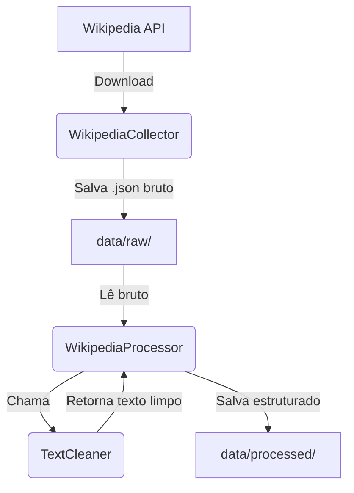

# 📥 Guia de Ingestão de Dados

Este documento descreve a arquitetura, o design e o funcionamento do pipeline de ingestão de dados do **BrasilnaCopaAI**. Ele explica como o conteúdo é coletado, limpo, estruturado e como você pode operá-lo para manter as informações sempre atualizadas.

---

## 🏗️ Arquitetura do Pipeline

O pipeline de ingestão reside no pacote [app/ingestion](../app/ingestion/) e foi construído de forma desacoplada seguindo três responsabilidades claras:



### 1. Coleta (`WikipediaCollector`)
Implementado na classe [WikipediaCollector](../app/ingestion/collector.py), é responsável por:
* Conectar-se à API da Wikipédia em português.
* Sanitizar os títulos dos artigos para gerar nomes de arquivos seguros (`ex: Seleção Brasileira -> seleção_brasileira.json`).
* Baixar o título, a URL de origem, o resumo e o conteúdo completo, salvando-os em formato bruto sob [data/raw/](../data/raw/).
* Utilizar cache local para evitar requisições repetidas na rede (a menos que a re-importação forçada seja solicitada).

### 2. Limpeza de Ruídos (`TextCleaner`)
Implementado na classe [TextCleaner](../app/ingestion/cleaner.py), é encarregado de higienizar o texto bruto:
* Identifica e remove seções não semânticas do final das páginas da Wikipédia que não contribuem para o RAG, tais como: *"Referências"*, *"Ligações externas"*, *"Ver também"*, *"Notas"*, *"Bibliografia"*, etc.
* Suporta sub-cabeçalhos (`===`) e cabeçalhos combinados usando expressões regulares robustas.
* Remove linhas em branco excessivas e espaços horizontais múltiplos (preservando apenas uma quebra de linha entre parágrafos).

### 3. Orquestração (`WikipediaProcessor`)
A classe [WikipediaProcessor](../app/ingestion/processor.py) une a coleta e a limpeza de dados:
* Lê o JSON bruto do diretório `data/raw/`.
* Limpa o conteúdo usando o `TextCleaner`.
* Calcula metadados estatísticos (número de caracteres e de palavras).
* Gera o arquivo final estruturado sob [data/processed/](../data/processed/).

---

## 🛠️ Como Operar a Ingestão (Comandos CLI)

O ponto de entrada para execução é o script [app/ingestion/run.py](../app/ingestion/run.py). 

> [!IMPORTANT]
> Para garantir que a aplicação resolva corretamente os caminhos dos pacotes internos, execute sempre os comandos a partir da raiz do repositório utilizando a flag `-m` do Python.

### 1. Ingestão Padrão (Carga Inicial)
Este comando executa a coleta dos artigos principais configurados por padrão (como a história da Seleção, títulos, confederação e a Copa de 2026).
```bash
python -m app.ingestion.run
```

### 2. Forçar Re-importação (Atualização de Dados)
Se os artigos na Wikipédia foram atualizados e você deseja sobrescrever os arquivos brutos locais, adicione a flag `--force` ou `-f`:
```bash
python -m app.ingestion.run --force
```

### 3. Inserir Novos Artigos Dinamicamente
Para injetar qualquer novo artigo da Wikipédia na base do sistema, passe os títulos desejados através da flag `--pages` ou `-p`:
```bash
python -m app.ingestion.run --pages "Copa do Mundo FIFA de 2026" "Neymar" "Maracanã"
```

---

## 📂 Estrutura dos Arquivos de Saída

### Arquivo Processado Final (`data/processed/`)
Os arquivos sob `data/processed/` são salvos como JSON estruturado no seguinte padrão, ideal para ser consumido diretamente pela vetorização e pipeline RAG:

```json
{
    "title": "Títulos da Seleção Brasileira de Futebol",
    "source_url": "https://pt.wikipedia.org/wiki/...",
    "cleaned_text": "Neste artigo, encontram-se listados todos os títulos da Seleção Brasileira de Futebol...",
    "metadata": {
        "source": "wikipedia",
        "title": "Títulos da Seleção Brasileira de Futebol",
        "url": "https://pt.wikipedia.org/wiki/...",
        "word_count": 227,
        "char_count": 1471,
        "processed_at": "2026-07-02T15:32:33.685787"
    }
}
```
